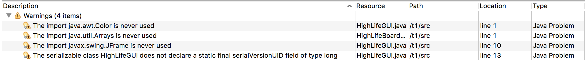
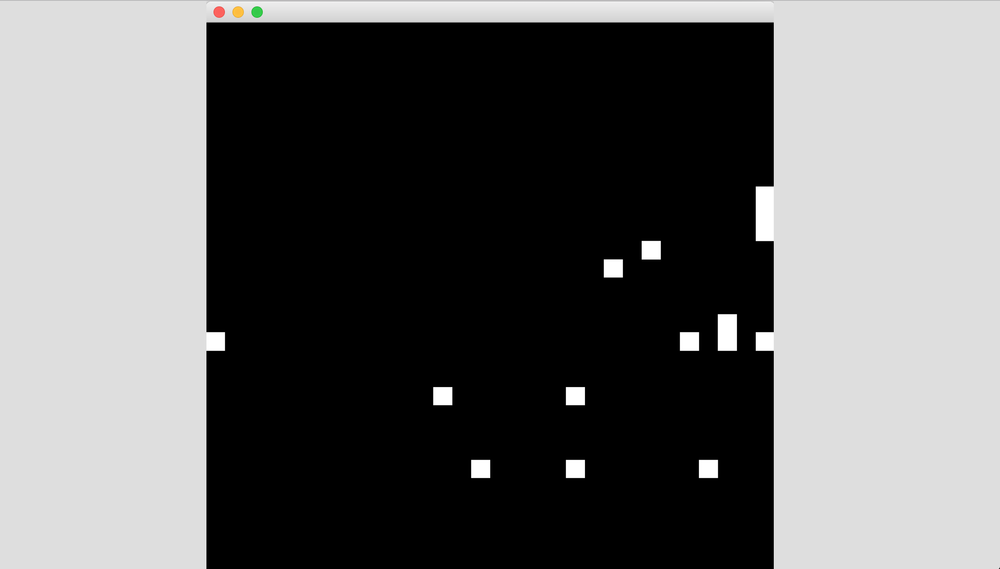
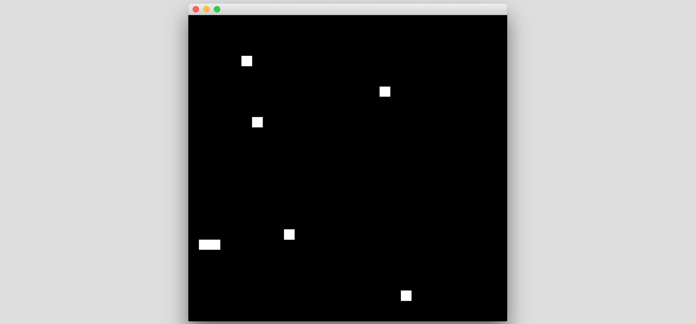
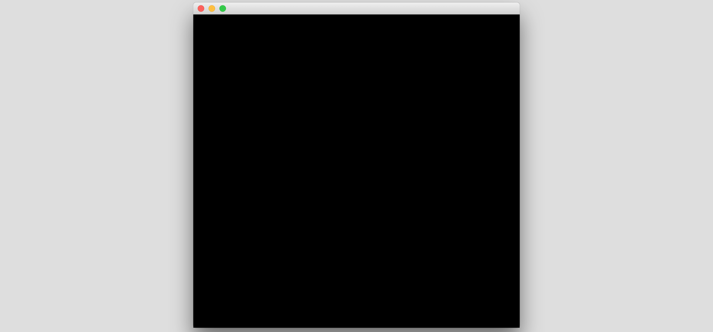

# IIC3745 Testing - Tarea 1

### Preparando desarrollo de tests

El primer paso para desarrollar la tarea fue importar los archivos de la carpeta `HighLife/src` en un nuevo proyecto de Eclipse. Al hacer esto se mostraron _warnings_ dentro del programa, los cuales fueron arreglados.



Ahora con el proyecto sin _warnigs_ se procede a correr el programa.







Luego de correrlo varias veces pareciera ser que ocurren las siguientes situaciones:

- No se respeta la regla de sobrevivencia. Es decir, si una célula viva tiene 2 o 3 vecinos muere, en vez de mantenerse viva
- Si se respeta la regla para crear nuevas células.

Para probar la primera hipótesis se aumentó la probabilidad de que una célula este viva al principio (estado inicial). Esto se realiza cambiando la línea donde se realiza `random` en el constructor de `HighLifeBoard`. Se deja la lína como `this.board[i][j] = Math.random() > 0.4 ? true : false;` y se prueba de nuevo. Se confirma que las células siempre mueren (aún cuando deberían sobrevivir). También a veces se crea una nueva. También se cambió el orden de la simulación para tener el primer `setDisplayData` antes de comenzar a simular y también `Thread.sleep(1000);` antes de `board.simulate();` para poder apreciar mejor lo que sucede.

Con esto en mente se procede a revisar el código en búsqueda de potenciales objetivos de UN. Para ello solo se revisa el archivo [`HighLife/src/HighLifeBoard.java`](HighLife/src/HighLifeBoard.java), dado que la funcionalidad del juego se encuentra contenida en dicho archivo.

`public boolean[][] getData()`: Dado que se puede crear un _board_ a partir de una matriz fija, podemos usar este método para testear el constructor junto con este método. Para ello creamos un nuevo _HighLifeBoard_ a partir de una matriz, luego revisamos que el retorno de `getData` coincida con este.

`public void setCell(int i, int j, boolean value)`: Este método setea el valor de una celda. Se espera que cuando se le de un valor para cierta coordenada dicha celda tenga ese valor. Luego, se puede testear dandole distintas coordenadas junto con distintos estados y luego revisar si `board[][]` tiene el valor que se le dio llamando a `setCell`.

`public HighLifeBoard(int length, int width, boolean random)`: Este método rellena el _board_ de manera aleatoria (si se le pide). Si no, crea un _board_ vacío. Se puede testear llamando con `random` `true` y `false`, luego revisar que si es `false` no haya ninguna célula viva. Si es `true` debería haber alguna célula viva. Dado que se llena de manera aleatoria no podemos definir un número fijo que debería cumplirse, por lo que testear porque haya por lo menos 1 debería ser suficiente.

`public HighLifeBoard(int length, int width)`: Este constructor puede ser testeado de la misma forma que el anterior, revisando que el _board_ este vacío.

`public HighLifeBoard(boolean[][] board)`: Este método es testeado junto con `getData()`.

`public boolean isAlive(int i, int j)`: Importante testear este método para que retorne el valor correcto. Cabe destacar que se debería testear llamando con coordenadas válidas como no válidas (fuera del mapa) y luego probar que se cumplan las reglas (por ejemplo, que todo fuera del mapa sea considerado `false`).

`public int countAliveNeighbors(int i, int j)`: También importante de testear. Para ello podemos crear un _board_ propio y revisar que los conteos de vecinos sean iguales a los esperados de acuerdo a las reglas del juego. Tomar en cuenta casos dentro del _board_ como en el borde y fuera.

`public boolean shouldSurvive(int i, int j)`: Testear con un _board_ predefinido y revisar que retorne correctamente en base a las reglas. Importante probar también con casos borde. Con una mirada rápida se puede apreciar que tiene un error ya que hace `numAliveNeighbors == 2 && numAliveNeighbors == 3` en vez de `numAliveNeighbors == 2 || numAliveNeighbors == 3`. Esto va de la mano con las primeras hipótesis sobre el programa (ver más arriba) y quedará en evidencia en los tests. Tampoco se revisa que la célula esté viva en primer lugar.

`public boolean shouldBeBorn(int i, int j)`: Mismo que el anterior. También se aprecia un error ya que solo revisa si se tienen 6 vecinos, cuando tener 3 también resulta en un nacimiento. Tampoco se revisa que la célula esté muerta en primer lugar.

`public boolean calculateNextState(int i, int j)`: Este método es más complejo de probar ya que para ello tenemos que tener un _board_ predefinido y luego probar que el futuro estado de las células coincida con el calculado a mano.

`public void simulate()`: Lo mismo que el método anterior pero se debe tomar en cuenta todo el board, no solo casos en particular.

`public String toString()`: Este método también podría ser testeado, pero no tiene tanto valor. Esto dado que si los métodos anteriores están correctos se podrá apreciar facilmente en consola si este tiene un problema.

Con esta información en mente se proceden a crear los distintos tests, los cuales se pueden encontrar en [`HighLife/src/HighLifeBoardTests.java`](HighLife/src/HighLifeBoardTests.java).

### Creando y ejecutando tests. Bug fixes

Primero se crean tests para probar la creación del _board_, estos son:
- shouldCreateBoardWithSizeTest
- shouldCreateBoardWithSizeNoRandomTest
- shouldCreateBoardWithSizeAndRandomTest
- shouldCreateBoardWithBoardTest

Estos pasan todos, por lo que no hay que hacer modificaciones ni a los contructores ni a `getData`.

Luego se crean tests para probar el seteo de celdas (`setCell`), este test es `shouldSetCellTest`. Para ello se prueba la celda (0,0), cambiando su valor a `false`, checkear que sea `false` y luego a `true` y checkear que sea `true`. También la implementación se encarga de que uno no escape de los bordes, cambiando los indices al correspondiente al borde. Por ello, se prueba el (0,0) usando (-1,-1) y el (length, width) usando (length+1, width+1). Este test falla, primero por que no se setean los valores correctamente y luego por salir del bound del array. Por lo que se modifica el código:

```java
// Código con error, no pasa test
public void setCell(int i, int j, boolean value) {
	if(i < 0)
		i = 0;
	else if(i >= this.length)
		i = this.length - 1;

	if(j < 0)
		j = 0;
	else if(j >= this.width)
		i = this.width - 1;
}
```

```java
// Código arreglado, pasa test
public void setCell(int i, int j, boolean value) {
	if(i < 0)
		i = 0;
	else if(i >= this.length)
		i = this.length - 1;

	if(j < 0)
		j = 0;
	else if(j >= this.width)
		j = this.width - 1; // Aquí se estaba cambiando i en vez de j

	board[i][j] = value; // No se hacía la asignación
}
```

Los errores fueron porque primero faltaba la asignación del valor. Luego de arreglar esto se comprueba, al revisar fuera de los bordes, que hay una asignación de borde mala, ya que el test sigue fallando.

Despues se checkea la revisión de si una celda está vacía. La regla para esto es:
1. Si se está dentro del _board_, obtener el valor directamente de este
2. Si se está fuera del _board_, entonces se considera como muerta

Esto implica que las celdas en las orillas solo pueden tener un máximo de 5 vecinos. Para checkear esto se crea el test `shouldCheckCellAlive`. Este falla, por lo que se cambia el código para que cumpla con las reglas mencionadas.

```java
// Código con error, no pasa test
public boolean isAlive(int i, int j) {
  if(i < 0 || i >= length)
    return false;
  else if (j < 0 || j >= width)
    return true;
  else
    return board[i][j];
}
```

```java
// Código arreglado, pasa test
public boolean isAlive(int i, int j) {
  if(i < 0 || i >= length || j < 0 || j >= width) // Fuera del borde es muerto
    return false;
  return board[i][j];
}
```

Luego se pasa a testear el método `countAliveNeighbors` a través del test `shouldCountAliveNeighborsTest`. Primero se prueba con el punto (0,1), el cual no tiene vecinos, y el test falla. Esto ya que dice que tiene 1 vecino. Inspeccionando el código se ve que se está contando el punto mismo (i,j) como vecino, lo cual es incorrecto. Se prueban también varios otros puntos, en particular casos bordes, pero no se encuentran más problemas. El cambio de código es el siguiente:

```java
// Código con error, no pasa test
public int countAliveNeighbors(int i, int j) {

  int total = 0;

  total += this.isAlive(i - 1, j - 1) ? 1 : 0;
  total += this.isAlive(i - 1, j) ? 1 : 0;
  total += this.isAlive(i - 1, j + 1) ? 1 : 0;
  total += this.isAlive(i, j - 1) ? 1 : 0;
  total += this.isAlive(i, j) ? 1 : 0;
  total += this.isAlive(i, j + 1) ? 1 : 0;
  total += this.isAlive(i + 1, j - 1) ? 1 : 0;
  total += this.isAlive(i + 1, j) ? 1 : 0;
  total += this.isAlive(i + 1, j + 1) ? 1 : 0;

  return total;
}
```

```java
// Código arreglado, pasa test
public int countAliveNeighbors(int i, int j) {

  int total = 0;

  total += this.isAlive(i - 1, j - 1) ? 1 : 0;
  total += this.isAlive(i - 1, j) ? 1 : 0;
  total += this.isAlive(i - 1, j + 1) ? 1 : 0;
  total += this.isAlive(i, j - 1) ? 1 : 0;
  // total += this.isAlive(i, j) ? 1 : 0; // Se elimina esta línea
  total += this.isAlive(i, j + 1) ? 1 : 0;
  total += this.isAlive(i + 1, j - 1) ? 1 : 0;
  total += this.isAlive(i + 1, j) ? 1 : 0;
  total += this.isAlive(i + 1, j + 1) ? 1 : 0;

  return total;
}
```

Luego pasamos a probar el método `shouldSurvive` a través del test `shouldDecideIfSurviveTest`. El test falla para celdas que tienen 2 y 3 vecinos, pero no falla cuando la celda debería morir. Se revisa el código y el problema es que se está usando `&&` en vez de `||`. Esto dado que una célula no puede tener 2 y 3 vecinos al mismo tiempo. El cambio de código es el siguiente:

```java
// Código con error, no pasa test
public boolean shouldSurvive(int i, int j) {

  int numAliveNeighbors = this.countAliveNeighbors(i, j);

  if(numAliveNeighbors == 2 && numAliveNeighbors == 3)
    return true;
  else
    return false;
}
```

```java
// Código arreglado, pasa test
public boolean shouldSurvive(int i, int j) {
  int numAliveNeighbors = this.countAliveNeighbors(i, j);

  if(numAliveNeighbors == 2 || numAliveNeighbors == 3)
    return true;
  return false;
}
```
