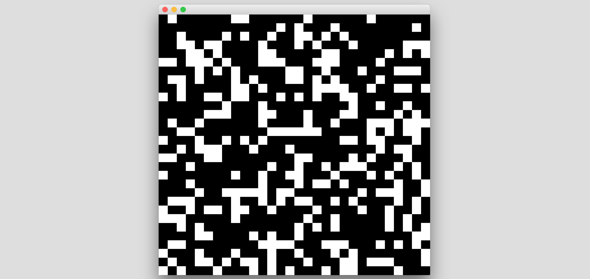

# IIC3745 Testing - Tarea 1

### Preparando desarrollo de tests

El primer paso para desarrollar la tarea fue importar los archivos de la carpeta `HighLife/src` en un nuevo proyecto de Eclipse. Al hacer esto se mostraron _warnings_ dentro del programa, los cuales fueron arreglados.

Ahora con el proyecto sin _warnigs_ se procede a correr el programa.

Luego de correrlo varias veces pareciera ser que ocurren las siguientes situaciones:

- No se respeta la regla de sobrevivencia. Es decir, si una célula viva tiene 2 o 3 vecinos muere, en vez de mantenerse viva
- Si se respeta la regla para crear nuevas células.

Para probar la primera hipótesis se aumentó la probabilidad de que una célula este viva al principio (estado inicial). Esto se realiza cambiando la línea donde se realiza `random` en el constructor de `HighLifeBoard`. Se deja la lína como `this.board[i][j] = Math.random() > 0.4 ? true : false;` y se prueba de nuevo. Se confirma que las células siempre mueren (aún cuando deberían sobrevivir). También a veces se crea una nueva.

Con esto en mente se procede a revisar el código en búsqueda de potenciales objetivos de UN. Para ello solo se revisa el archivo [`HighLife/src/HighLifeBoard.java`](HighLife/src/HighLifeBoard.java), dado que la funcionalidad del juego se encuentra contenida en dicho archivo.

`public boolean[][] getData()`: Dado que se puede crear un board a partir de una matriz fija, podemos usar este método para testear el constructor junto con este método. Para ello creamos un nuevo _HighLifeBoard_ a partir de una matriz, luego revisamos que el retorno de `getData` coincida con este.

`public void setCell(int i, int j, boolean value)`: Este método setea el valor de una celda. Se espera que cuando se le de un valor para cierta coordenada dicha celda tenga ese valor. Luego, se puede testear dandole distintas coordenadas junto con distintos estados y luego revisar si `board[][]` tiene el valor que se le dio llamando a `setCell`.

`public HighLifeBoard(int length, int width, boolean random)`: Este método rellena el board de manera aleatoria (si se le pide). Si no, crea un board vacío. Se puede testear llamando con `random` `true` y `false`, luego revisar que si es `false` no haya ninguna célula viva. Si es `true` debería haber alguna célula viva. Dado que se llena de manera aleatoria no podemos definir un número fijo que debería cumplirse, por lo que testear porque haya por lo menos 1 debería ser suficiente.

`public HighLifeBoard(int length, int width)`: Este constructor puede ser testeado de la misma forma que el anterior, revisando que el board este vacío.

`public HighLifeBoard(boolean[][] board)`: Este método es testeado junto con `getData()`.

`public boolean isAlive(int i, int j)`: Importante testear este método para que retorne el valor correcto. Cabe destacar que se debería testear llamando con coordenadas válidas como no válidas (fuera del mapa) y luego probar que se cumplan las reglas (por ejemplo, que todo fuera del mapa sea considerado `false`).

`public int countAliveNeighbors(int i, int j)`: También importante de testear. Para ello podemos crear un board propio y revisar que los conteos de vecinos sean iguales a los esperados de acuerdo a las reglas del juego. Tomar en cuenta casos dentro del board como en el borde y fuera.

`public boolean shouldSurvive(int i, int j)`: Testear con un board predefinido y revisar que retorne correctamente en base a las reglas. Importante probar también con casos borde. Con una mirada rápida se puede apreciar que tiene un error ya que hace `numAliveNeighbors == 2 && numAliveNeighbors == 3` en vez de `numAliveNeighbors == 2 || numAliveNeighbors == 3`. Esto va de la mano con las primeras hipótesis sobre el programa (ver más arriba) y quedará en evidencia en los tests. Tampoco se revisa que la célula esté viva en primer lugar.

`public boolean shouldBeBorn(int i, int j)`: Mismo que el anterior. También se aprecia un error ya que solo revisa si se tienen 6 vecinos, cuando tener 3 también resulta en un nacimiento. Tampoco se revisa que la célula esté muerta en primer lugar.

`public boolean calculateNextState(int i, int j)`: Este método es más complejo de probar ya que para ello tenemos que tener un board predefinido y luego probar que el futuro estado de las células coincida con el calculado a mano.

`public void simulate()`: Lo mismo que el método anterior pero se debe tomar en cuenta todo el board, no solo casos en particular.

`public String toString()`: Este método también podría ser testeado, pero no tiene tanto valor. Esto dado que si los métodos anteriores están correctos se podrá apreciar facilmente en consola si este tiene un problema.

Con esta información en mente se proceden a crear los distintos tests, los cuales se pueden encontrar en [`HighLife/src/HighLifeBoardTests.java`](HighLife/src/HighLifeBoardTests.java).

### Creando y ejecutando tests. Bug fixes
